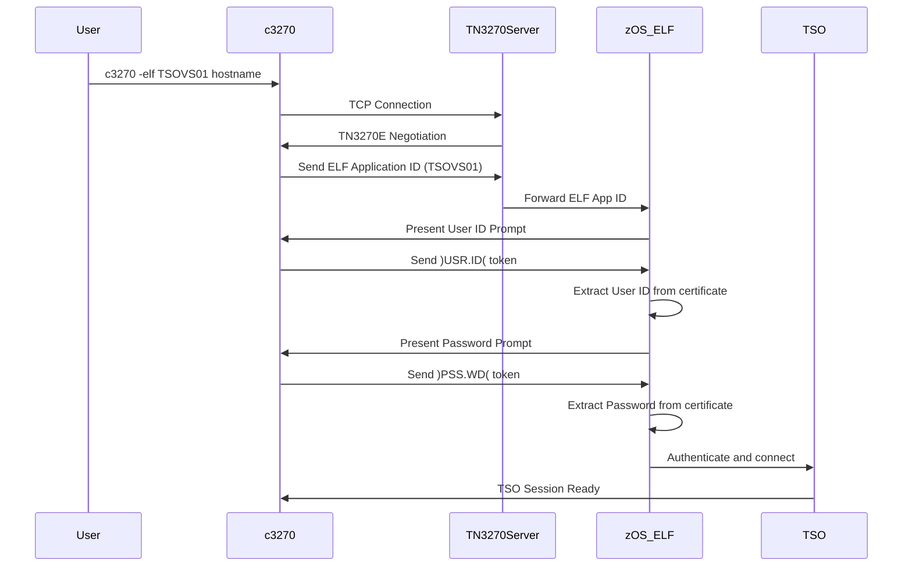

# c3270 ELF Enablement Implementation Plan

## Executive Summary

This document provides a comprehensive plan for implementing Enhanced Logon Facility (ELF) support in c3270, based on the successful PCOMM implementation and existing `-elf` option patches.

**Goal**: Enable c3270 to automatically authenticate to z/OS applications using ELF tokens, eliminating the need for manual credential entry.

## Background

### What is ELF?

Enhanced Logon Facility (ELF) is an IBM mainframe feature that enables automatic logon to z/OS applications using certificate-based authentication. Instead of transmitting actual credentials, the client sends special tokens that instruct z/OS to extract credentials from the client's certificate.

### ELF Tokens

- **`)USR.ID(`** - Instructs ELF to use the user ID from the client certificate
- **`)PSS.WD(`** - Instructs ELF to use the password/passticket from the certificate

### Current Status

**Completed**:
- ✅ Command-line option `-elf <app-id>` has been implemented
- ✅ Three patches created:
  - [`patches/appres.h.patch`](../patches/appres.h.patch) - Added `char *elf` field to appres structure
  - [`patches/resources.h.patch`](../patches/resources.h.patch) - Added `ResElf` and `OptElf` constants
  - [`patches/glue.c.patch`](../patches/glue.c.patch) - Registered option and initialized field

**Remaining**:
- ❌ ELF Application ID transmission during TN3270E negotiation
- ❌ ELF token transmission (`)USR.ID(` and `)PSS.WD(`)
- ❌ Integration with login macro system
- ❌ Testing and validation

## Architecture Overview

### Communication Flow

```
[c3270 Client] <--TN3270 Protocol--> [TN3270 Server] <--> [z/OS ELF] <--> [TSO/VTAM]
   (Desktop)          (Network)           (z/OS)          (z/OS)        (z/OS)
```

### ELF Workflow in c3270



## Implementation Plan

### Phase 1: TN3270E Negotiation - ELF Application ID

**Objective**: Send the ELF Application ID during TN3270E subnegotiation.

**Files to Modify**:
- `suite3270-4.4/Common/telnet.c` (or equivalent TN3270E negotiation code)
- Look for TN3270E DEVICE-TYPE or CONNECT subnegotiation

**Implementation Steps**:

1. **Locate TN3270E Negotiation Code**
   - Search for TN3270E subnegotiation handling
   - Find where DEVICE-TYPE or terminal name is sent
   - Identify the function that handles TN3270E CONNECT

2. **Add ELF Application ID Transmission**
   ```c
   // Pseudocode - actual implementation will vary
   if (appres.elf != NULL) {
       // During TN3270E negotiation, send ELF Application ID
       // This typically happens during DEVICE-TYPE or CONNECT subnegotiation
       send_tn3270e_elf_applid(appres.elf);
   }
   ```

3. **Protocol Details**
   - ELF Application ID is sent as part of TN3270E subnegotiation
   - Format: IAC SB TN3270E CONNECT <device-type> <elf-app-id> IAC SE
   - The exact format may vary - refer to IBM TN3270E RFC and ELF documentation

**Testing**:
- Verify ELF Application ID is transmitted during connection
- Use packet capture (tcpdump/wireshark) to verify protocol
- Test with z/OS system configured for ELF

### Phase 2: ELF Token Transmission

**Objective**: Automatically send ELF tokens when prompts are detected.

**Approach**: Integrate with existing login macro system or create dedicated ELF handler.

#### Option A: Login Macro Integration (Recommended)

**Rationale**: c3270 already has a login macro system. We can auto-generate an ELF macro.

**Implementation**:

1. **Auto-Generate ELF Login Macro**
   ```c
   // In connection initialization code
   if (appres.elf != NULL && appres.login_macro == NULL) {
       // Auto-generate a login macro that sends ELF tokens
       appres.login_macro = create_elf_login_macro();
   }
   ```

2. **ELF Login Macro Content**
   ```
   # Wait for User ID prompt
   Wait(InputField)
   String()USR.ID()
   Enter()
   
   # Wait for Password prompt
   Wait(InputField)
   String()PSS.WD()
   Enter()
   ```

3. **Macro Timing Considerations**
   - Use `Wait(InputField)` to detect prompts
   - May need to add screen position detection (like PCOMM's `WaitForAttrib`)
   - Consider timeout handling

**Files to Modify**:
- Login macro generation code (search for existing macro handling)
- May need to create new function: `create_elf_login_macro()`

#### Option B: Dedicated ELF Handler

**Alternative**: Create a dedicated ELF authentication handler separate from macros.

**Implementation**:

1. **Screen State Detection**
   - Monitor for User ID prompt (detect specific screen attributes)
   - Monitor for Password prompt

2. **Token Transmission**
   ```c
   void handle_elf_authentication(void) {
       if (elf_state == WAITING_FOR_USERID) {
           send_string(")USR.ID(");
           send_enter();
           elf_state = WAITING_FOR_PASSWORD;
       } else if (elf_state == WAITING_FOR_PASSWORD) {
           send_string(")PSS.WD(");
           send_enter();
           elf_state = AUTHENTICATED;
       }
   }
   ```

3. **State Machine**
   - Track ELF authentication state
   - Handle errors and timeouts
   - Disable after successful authentication

**Files to Modify**:
- Screen update handler
- Create new ELF authentication module

### Phase 3: Certificate Configuration

**Objective**: Ensure c3270 can use client certificates for ELF.

**Requirements**:
- c3270 must support TLS/SSL client certificates
- Certificate must be properly configured
- Certificate must be mapped to z/OS user ID in RACF

**Implementation**:

1. **Verify TLS Support**
   - Check if c3270 already supports `-cert` and `-certfile` options
   - Verify OpenSSL integration

2. **Documentation**
   - Document certificate requirements
   - Provide examples of certificate configuration
   - Document RACF mapping requirements

**Files to Check**:
- TLS/SSL configuration code
- Certificate handling code

### Phase 4: Error Handling and Validation

**Objective**: Robust error handling and user feedback.

**Implementation**:

1. **Validation**
   ```c
   // Validate ELF Application ID format
   if (appres.elf != NULL) {
       if (strlen(appres.elf) == 0) {
           xs_warning("ELF application ID cannot be empty");
           appres.elf = NULL;
       }
       if (strlen(appres.elf) > 8) {
           xs_warning("ELF application ID too long (max 8 characters)");
           appres.elf = NULL;
       }
       // Validate alphanumeric characters
       for (int i = 0; appres.elf[i]; i++) {
           if (!isalnum(appres.elf[i])) {
               xs_warning("ELF application ID contains invalid characters");
               appres.elf = NULL;
               break;
           }
       }
   }
   ```

2. **Error Scenarios**
   - ELF not enabled on z/OS
   - Invalid Application ID
   - Certificate not configured
   - Certificate not mapped in RACF
   - Authentication failure

3. **User Feedback**
   - Clear error messages
   - Status indicators
   - Logging for troubleshooting

### Phase 5: Testing Strategy

**Test Cases**:

1. **Basic Functionality**
   - ✅ `-elf` option accepts parameter
   - ✅ `-elf` option rejects missing parameter
   - ✅ Value accessible via `appres.elf`
   - ✅ Help text displays correctly

2. **Protocol Testing**
   - ❌ ELF Application ID transmitted during TN3270E negotiation
   - ❌ ELF tokens transmitted at correct prompts
   - ❌ Successful authentication with valid certificate
   - ❌ Proper error handling with invalid certificate

3. **Integration Testing**
   - ❌ Works with TLS/SSL connections
   - ❌ Works with different z/OS applications
   - ❌ Compatible with existing c3270 features
   - ❌ Session file support

4. **Error Testing**
   - ❌ Invalid Application ID format
   - ❌ Missing certificate
   - ❌ Invalid certificate
   - ❌ ELF not enabled on z/OS
   - ❌ Authentication failure

**Testing Environment**:
- z/OS system with ELF enabled
- RACF configured with certificate mapping
- Valid client certificate
- Test application ID (e.g., TSOVS01)

**Testing Tools**:
- Packet capture (tcpdump/wireshark) for protocol verification
- z/OS system logs for authentication tracking
- c3270 trace output for debugging

## Technical Details

### TN3270E Protocol

**Key Concepts**:
- TN3270E is an extension of TN3270 protocol
- Uses IAC (Interpret As Command) sequences
- Subnegotiation for extended features
- ELF uses TN3270E CONNECT subnegotiation

**Protocol Format**:
```
IAC SB TN3270E <function> <parameters> IAC SE

Where:
- IAC = 0xFF (255)
- SB = 0xFA (250) - Subnegotiation Begin
- SE = 0xF0 (240) - Subnegotiation End
- TN3270E = 0x28 (40)
```

**ELF Application ID Transmission**:
- Sent during TN3270E CONNECT subnegotiation
- Format may vary by implementation
- Refer to IBM documentation for exact format

### Screen Detection

**User ID Prompt Detection**:
- Look for specific screen attributes
- Common patterns:
  - "USERID ===> _____"
  - "User ID:"
  - Cursor at specific position

**Password Prompt Detection**:
- Look for password field attributes
- Common patterns:
  - "Password ===> _____"
  - "Password:"
  - Hidden input field

**Implementation Approaches**:
1. **Attribute-Based**: Check field attributes (like PCOMM's `WaitForAttrib`)
2. **Text-Based**: Search for specific text patterns
3. **Position-Based**: Check cursor position
4. **Hybrid**: Combination of above methods

### z/OS Configuration Requirements

**Critical Setting**:
```
PASSWORDPREPROMPT(OFF)
```

**Why Required**:
- With `PASSWORDPREPROMPT(ON)`, z/OS prompts for password immediately after user ID
- This disrupts ELF token timing
- ELF tokens must be sent in sequence
- `PASSWORDPREPROMPT(OFF)` allows proper token processing

**RACF Configuration**:
- Client certificate must be installed in RACF
- Certificate must be mapped to z/OS user ID
- User must have appropriate permissions
- Passticket generation must be enabled

## Implementation Priorities

### High Priority (Must Have)
1. ✅ Command-line option `-elf` (COMPLETED)
2. ❌ ELF Application ID transmission during TN3270E negotiation
3. ❌ ELF token transmission (`)USR.ID(` and `)PSS.WD(`)
4. ❌ Basic error handling

### Medium Priority (Should Have)
5. ❌ Integration with login macro system
6. ❌ Certificate configuration validation
7. ❌ Comprehensive error messages
8. ❌ Status indicators

### Low Priority (Nice to Have)
9. ❌ Advanced screen detection
10. ❌ Configurable token format
11. ❌ Multiple authentication methods
12. ❌ Session file support for ELF settings

## Code Organization

### Recommended File Structure

```
suite3270-4.4/
├── Common/
│   ├── telnet.c          # TN3270E negotiation - ADD ELF App ID transmission
│   ├── elf.c             # NEW: ELF-specific functionality
│   ├── elf.h             # NEW: ELF header file
│   └── glue.c            # MODIFIED: Option registration (already done)
├── include/
│   ├── appres.h          # MODIFIED: Added elf field (already done)
│   └── resources.h       # MODIFIED: Added ResElf/OptElf (already done)
└── patches/
    ├── appres.h.patch    # EXISTING
    ├── resources.h.patch # EXISTING
    ├── glue.c.patch      # EXISTING
    ├── telnet.c.patch    # NEW: ELF App ID transmission
    └── elf.c.patch       # NEW: ELF functionality
```

### Suggested New Files

**`suite3270-4.4/Common/elf.c`**:
```c
/*
 * elf.c
 *     Enhanced Logon Facility (ELF) support for c3270
 */

#include "globals.h"
#include "appres.h"
#include "elf.h"

/* ELF authentication state */
typedef enum {
    ELF_DISABLED,
    ELF_WAITING_FOR_USERID,
    ELF_WAITING_FOR_PASSWORD,
    ELF_AUTHENTICATED,
    ELF_FAILED
} elf_state_t;

static elf_state_t elf_state = ELF_DISABLED;

/* Initialize ELF support */
void elf_init(void) {
    if (appres.elf != NULL) {
        elf_state = ELF_WAITING_FOR_USERID;
    }
}

/* Send ELF Application ID during TN3270E negotiation */
void elf_send_applid(void) {
    if (appres.elf != NULL) {
        // Send ELF Application ID
        // Implementation depends on TN3270E negotiation code
    }
}

/* Handle ELF authentication */
void elf_handle_authentication(void) {
    // Implementation based on chosen approach (macro or dedicated handler)
}

/* Validate ELF Application ID */
bool elf_validate_applid(const char *applid) {
    if (applid == NULL || strlen(applid) == 0) {
        return false;
    }
    if (strlen(applid) > 8) {
        return false;
    }
    for (int i = 0; applid[i]; i++) {
        if (!isalnum(applid[i])) {
            return false;
        }
    }
    return true;
}
```

**`suite3270-4.4/Common/elf.h`**:
```c
/*
 * elf.h
 *     Enhanced Logon Facility (ELF) support header
 */

#ifndef ELF_H
#define ELF_H

/* ELF tokens */
#define ELF_USERID_TOKEN ")USR.ID("
#define ELF_PASSWORD_TOKEN ")PSS.WD("

/* Function prototypes */
void elf_init(void);
void elf_send_applid(void);
void elf_handle_authentication(void);
bool elf_validate_applid(const char *applid);

#endif /* ELF_H */
```

## Integration Points

### 1. Connection Initialization
**File**: `suite3270-4.4/Common/host.c` (or equivalent)
**Action**: Call `elf_init()` after connection established

### 2. TN3270E Negotiation
**File**: `suite3270-4.4/Common/telnet.c`
**Action**: Call `elf_send_applid()` during TN3270E CONNECT subnegotiation

### 3. Screen Updates
**File**: Screen update handler
**Action**: Call `elf_handle_authentication()` when screen updates

### 4. Login Macro System
**File**: Login macro code
**Action**: Auto-generate ELF macro if `-elf` option provided

## Documentation Requirements

### User Documentation

1. **Man Page Updates**
   - Add `-elf` option to c3270 man page
   - Describe ELF functionality
   - Provide usage examples
   - Document certificate requirements

2. **README Updates**
   - Add ELF feature description
   - Provide configuration examples
   - Document z/OS requirements

3. **Examples**
   ```bash
   # Basic ELF usage
   c3270 -elf TSOVS01 mainframe.example.com
   
   # With TLS certificate
   c3270 -elf TSOVS01 -cert mycert.pem mainframe.example.com
   
   # With session file
   c3270 -elf PRODAPP session.c3270
   ```

### Developer Documentation

1. **Implementation Guide**
   - Architecture overview
   - Code organization
   - Integration points
   - Testing procedures

2. **Protocol Documentation**
   - TN3270E ELF protocol details
   - Packet format
   - Timing considerations

3. **Troubleshooting Guide**
   - Common issues
   - Debug procedures
   - Log analysis

## Risk Assessment

### Technical Risks

| Risk | Impact | Likelihood | Mitigation |
|------|--------|------------|------------|
| TN3270E protocol complexity | High | Medium | Study existing implementations, use packet capture |
| Screen detection reliability | Medium | High | Use multiple detection methods, add configuration options |
| Certificate configuration issues | High | Medium | Comprehensive documentation, validation checks |
| z/OS compatibility | High | Low | Test with multiple z/OS versions |
| Timing issues | Medium | Medium | Add configurable timeouts, robust state machine |

### Project Risks

| Risk | Impact | Likelihood | Mitigation |
|------|--------|------------|------------|
| Incomplete documentation | Medium | Medium | Research IBM documentation, analyze PCOMM behavior |
| Testing environment access | High | Low | Coordinate with z/OS team early |
| Scope creep | Medium | Medium | Stick to defined phases, defer nice-to-have features |

## Success Criteria

### Minimum Viable Product (MVP)
- ✅ `-elf` option implemented and working
- ❌ ELF Application ID transmitted during connection
- ❌ ELF tokens transmitted automatically
- ❌ Successful authentication with valid certificate
- ❌ Basic error handling

### Full Implementation
- All MVP criteria met
- Comprehensive error handling
- Complete documentation
- Automated tests
- Session file support
- Status indicators

## Timeline Estimate

### Phase 1: TN3270E Negotiation (2-3 days)
- Research TN3270E protocol
- Locate negotiation code
- Implement ELF Application ID transmission
- Test with packet capture

### Phase 2: ELF Token Transmission (3-5 days)
- Design authentication approach
- Implement token transmission
- Implement screen detection
- Test with z/OS system

### Phase 3: Certificate Configuration (1-2 days)
- Verify TLS support
- Document certificate requirements
- Test certificate configuration

### Phase 4: Error Handling (2-3 days)
- Implement validation
- Add error messages
- Test error scenarios

### Phase 5: Testing and Documentation (3-4 days)
- Comprehensive testing
- Write documentation
- Create examples
- Final validation

**Total Estimate**: 11-17 days

## Next Steps

1. **Immediate Actions**:
   - [ ] Locate TN3270E negotiation code in c3270 source
   - [ ] Study TN3270E protocol documentation
   - [ ] Set up packet capture for protocol analysis
   - [ ] Coordinate z/OS test environment access

2. **Research Tasks**:
   - [ ] Review IBM TN3270E RFC
   - [ ] Study ELF protocol documentation
   - [ ] Analyze PCOMM packet captures
   - [ ] Review c3270 login macro system

3. **Development Tasks**:
   - [ ] Implement Phase 1: ELF Application ID transmission
   - [ ] Implement Phase 2: ELF token transmission
   - [ ] Implement Phase 3: Certificate configuration
   - [ ] Implement Phase 4: Error handling
   - [ ] Implement Phase 5: Testing and documentation

## References

### Documentation
- [PCOMM ELF Overview](./PCOMMOverview.md)
- [Option Implementation Guide](../Option-Analysis/02-implementation-guide.md)
- IBM TN3270E RFC
- IBM ELF Documentation
- IBM RACF Security Administrator's Guide

### Code References
- Existing patches in [`patches/`](../patches/)
- Option analysis in [`Option-Analysis/`](../Option-Analysis/)
- c3270 source code in `suite3270-4.4/`

### Related Projects
- PCOMM (reference implementation)
- x3270 (similar project)
- Other TN3270 emulators with ELF support

## Appendix A: PCOMM Comparison

### PCOMM Implementation
- Uses VBScript macro
- `SetELFApplID` method for Application ID
- `SendKeys` for token transmission
- `WaitForAttrib` for screen detection
- `WaitForCursor` for cursor position

### c3270 Implementation
- Native C implementation
- TN3270E protocol for Application ID
- Direct token transmission
- Screen attribute detection
- Login macro integration

### Key Differences
- PCOMM: Macro-based, GUI-focused
- c3270: Native code, terminal-based
- PCOMM: Windows-specific
- c3270: Cross-platform (including z/OS)

## Appendix B: Glossary

- **ELF**: Enhanced Logon Facility - IBM mainframe automatic logon feature
- **TN3270E**: Extended TN3270 protocol with additional features
- **IAC**: Interpret As Command - Telnet protocol command prefix
- **RACF**: Resource Access Control Facility - z/OS security system
- **Passticket**: One-time password generated from certificate
- **VTAM**: Virtual Telecommunications Access Method - z/OS networking
- **TSO**: Time Sharing Option - z/OS interactive interface

## Version History

- **v1.0** (2026-05-28) - Initial implementation plan created